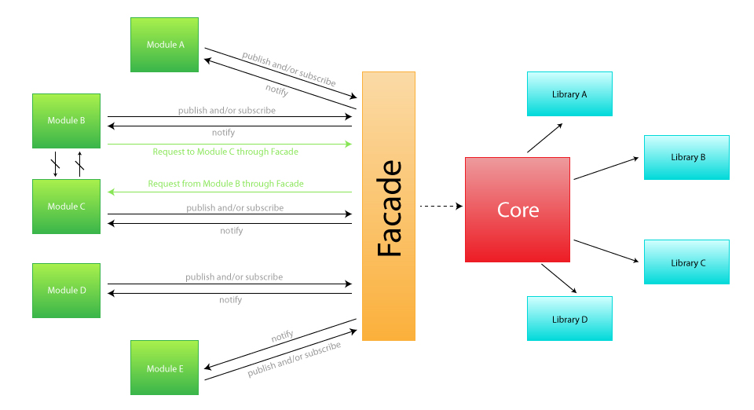

#Didgeridoo developer's handbook

##Server side

###Introduction

Didgeridoo is based on a stack of edge technologies, NodeJS ([CompoundJS](compoundjs.com) and [MongoDB](mongodb.org)).

###Installation

* [Install NodeJS](https://github.com/joyent/node/wiki/Installing-Node.js-via-package-manager)
* [Install MongoDB](http://docs.mongodb.org/manual/installation/)
* 

##Client side

###App structure

Didgeridoo is divided in four main parts or concepts. These are:

* Core
* Libraries
* Modules
* Actions

The **core** is a single file and it contains the main program, controlling the initialization of the app, the API and so on.

**Libraries** are script files that provide a better and simple experience while coding, such as jQuery, jQuery UI, Bootstrap, etc.

**Modules** differs from libraries that these are programs that do specific tasks or provide visual elements to the interface, usually based on the use of libraries (i.e. the Project Files explorer, the Designer, the CodeView).

For the purpose of loading modules and libraries you should use RequireJS ([requirejs.org]()), which is included by default.

	//Example: Loading the Underscore library at libraries/underscore

	require(['libraries/underscore/underscore-min'], function() {
		//Now you can use Underscore
	});

	//Example: Loading a Underscore library by its name, previously declared at
	// 		   /public/app/didgeridoo.js

	require(['underscore'], function() {
		//Now you can use Underscore
	});

An **action** is a kind of module that defines a common task. You should define an action when a common task can be done in various ways and you can't control all these ways. For example, a common task that fits that definition is the *FileSave* action, which can be performed via keyboard (Ctrl/Cmd+S), via top menu option File > Save, or even an automated script that eventually save all files.